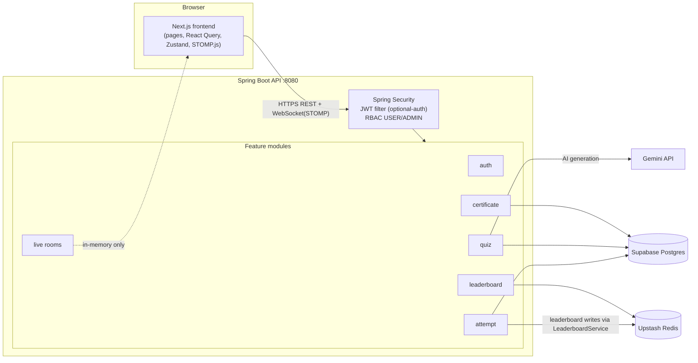
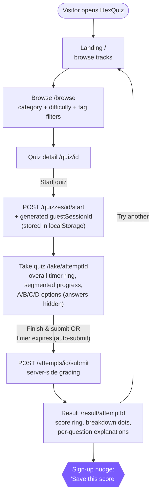
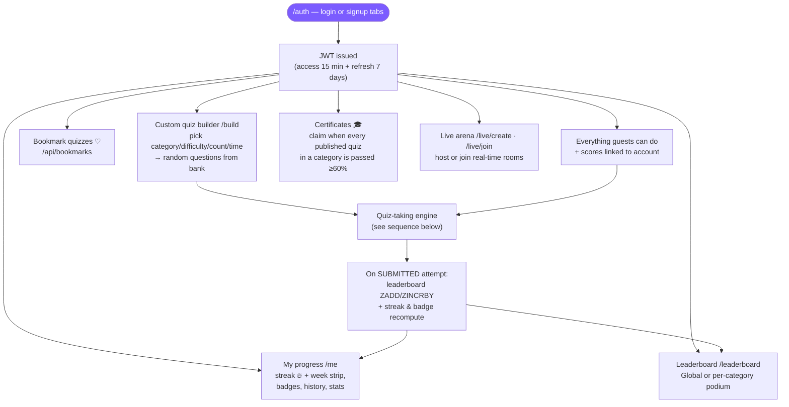
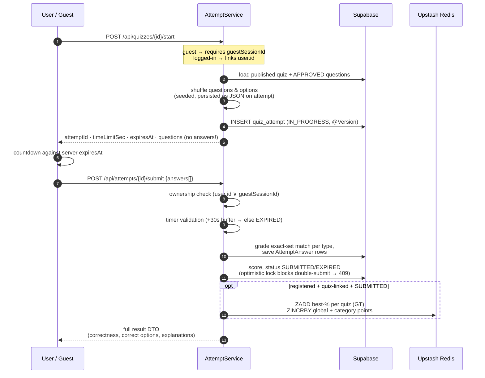
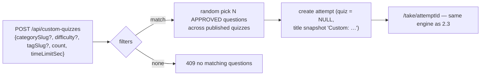
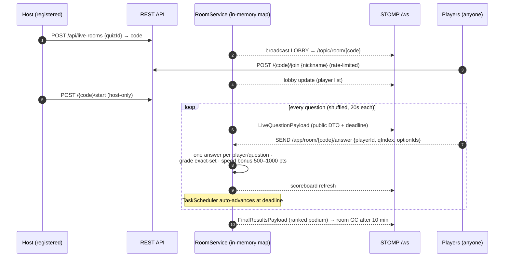
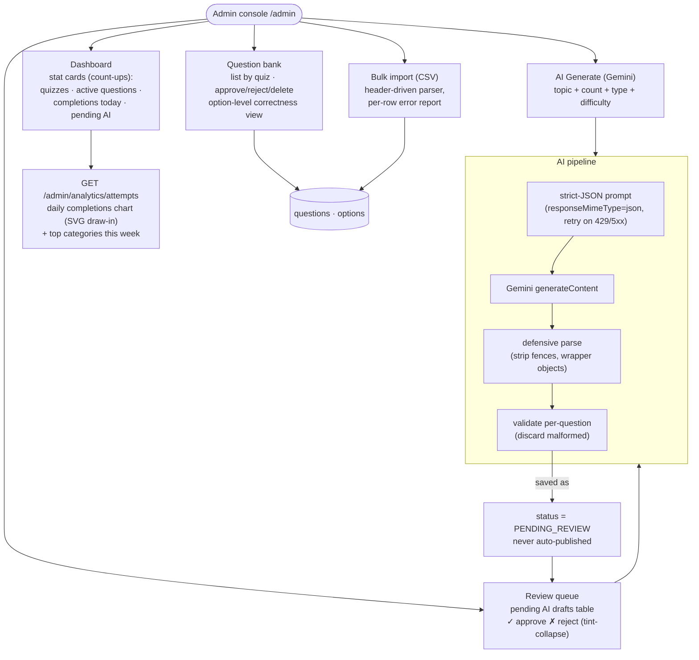
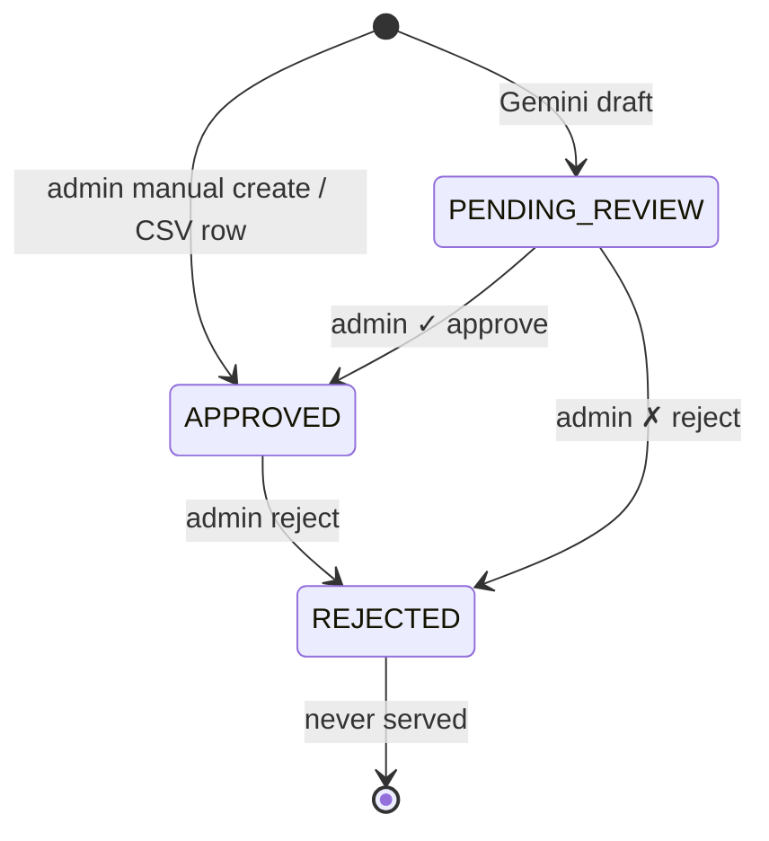

# HexQuiz — Architecture & Functionality Diagrams

Complete functional architecture of the IT quiz platform, split into **User-facing** and **Admin-facing** views.

- **Frontend:** Next.js 16 (App Router) + Tailwind v4 + TanStack Query + Zustand + STOMP.js
- **Backend:** Spring Boot 3.2 (Java 17) — modular monolith (`auth` · `user` · `quiz` · `attempt` · `leaderboard` · `certificate` · `live`)
- **Data:** Supabase (Postgres/JPA) · Upstash Redis (leaderboards) · Google Gemini (AI generation)

---

## 1. System Overview



---

## 2. USER-SIDE FUNCTIONALITY

### 2.1 Guest journey (no account required)



Guest attempts are tracked by `guestSessionId`; they are **excluded from history, leaderboards and certificates** until converted to an account.

### 2.2 Registered user journey



### 2.3 Quiz-taking engine (core sequence)



Anti-cheat guarantees: answers never serialized pre-submit · scoring 100% server-side · double-submit blocked by `@Version` · late submits capped at time limit.

### 2.4 Custom quiz builder



Registered users only. Custom attempts count toward stats/streaks but not leaderboards (no quiz linkage).

### 2.5 Live multiplayer room (Kahoot-style)



Rooms are ephemeral/in-memory (single-instance friendly). Spectators can watch without joining.

---

## 3. ADMIN-SIDE FUNCTIONALITY

All `/api/admin/**` routes require `ROLE_ADMIN` (`@PreAuthorize`); enforced again in the UI guard on `/admin`.

### 3.1 Admin capability map



### 3.2 Question lifecycle



> `QuestionStatus` has exactly three values: `PENDING_REVIEW`, `APPROVED`, `REJECTED`. "Playability" is not a status — an **APPROVED** question belonging to a **published** quiz is what the start-attempt shuffle serves.

### 3.3 Bulk CSV import contract

```csv
question_text,type,points,explanation,option_1,option_2,option_3,option_4,correct_options
"What is SQL injection?, in short?",MCQ,1,Injecting malicious SQL through unsanitised input,Asking the database for a backup,A firewall rule,A CSS framework,An encryption mode,1
Select prime numbers,MULTI_SELECT,2,,2,3,4,5,1|2|4
REST is stateless.,TRUE_FALSE,,,True,False,,,1
```

Rules: header row required · rows must supply every column (pad unused option slots with empty fields) · `correct_options` = 1-based indices joined by `|` · MCQ/TRUE_FALSE exactly one correct · TRUE_FALSE exactly two options. Response returns `{imported, failures[{line,error}]}` — valid rows commit, invalid rows reported.

### 3.4 Analytics endpoint

`GET /api/admin/analytics/attempts?days=7` →

```json
{ "daily": [{"date":"2026-08-22","count":5}, …],
  "topCategories": [{"name":"Python","count":2}, …],
  "today": 5 }
```

Zero-filled day series (SUBMITTED+EXPIRED completions) and ranked categories — rendered as the draw-in SVG chart and ranked panel on the Dashboard.

---

## 4. Data Model (Supabase Postgres)

```mermaid
erDiagram
    USERS ||--o{ QUIZ_ATTEMPTS : makes
    USERS ||--o{ BOOKMARKS : saves
    USERS ||--o{ CERTIFICATES : earns
    CATEGORIES ||--o{ QUIZZES : contains
    QUIZZES ||--o{ QUESTIONS : has
    QUESTIONS ||--o{ OPTIONS : offers
    QUIZZES }o--o{ TAGS : tagged
    QUIZ_ATTEMPTS ||--o{ ATTEMPT_ANSWERS : graded
    QUESTIONS ||--o{ ATTEMPT_ANSWERS : referenced-by
    ATTEMPT_ANSWERS ||--o{ ATTEMPT_ANSWER_SELECTED_OPTIONS : selected

    USERS { bigint id PK  varchar email UK  varchar password_hash  enum role  timestamp created_at }
    CATEGORIES { bigint id PK  varchar name UK  varchar slug UK }
    QUIZZES { bigint id PK  varchar title  bigint category_id FK  enum difficulty  int time_limit_sec  boolean is_published  bigint created_by FK }
    QUESTIONS { bigint id PK  bigint quiz_id FK  text question_text  enum type  int points  text explanation  enum status }
    OPTIONS { bigint id PK  bigint question_id FK  text option_text  boolean is_correct }
    TAGS { bigint id PK  varchar name  varchar slug UK }
    QUIZ_ATTEMPTS { bigint id PK  bigint user_id FK nullable  varchar guest_session_id  bigint quiz_id FK nullable  varchar title  int time_limit_sec  int score  enum status  text question_order  text option_order  bigint version }
    ATTEMPT_ANSWERS { bigint id PK  bigint attempt_id FK  bigint question_id FK  boolean is_correct }
    ATTEMPT_ANSWER_SELECTED_OPTIONS { bigint attempt_answer_id FK  bigint option_id }
    BOOKMARKS { bigint id PK  bigint user_id FK  bigint quiz_id FK }
    CERTIFICATES { bigint id PK  varchar code UK  bigint user_id FK  bigint category_id  varchar category_name }
```

Notable: `QUIZ_ATTEMPTS.quiz_id` is **nullable** — custom-builder attempts have no parent quiz (title/time snapshotted onto the row). Selected options live in the `attempt_answer_selected_options` join table (`@ElementCollection`), not a delimited column. Bookmarks enforce a unique `(user, quiz)` pair; certificates carry a unique public verification code. Redis holds only ranking sorted sets (`quizapp:lb:quiz/{id}`, `quizapp:lb:global`, `quizapp:lb:category/{id}`) — all source-of-truth lives in Postgres.

---

## 5. Access-control matrix

| Route group | Method(s) | Access |
|---|---|---|
| `/api/auth/**` | POST | Public (register/login/refresh) — rate-limit 5/min/IP |
| `/api/quizzes`, `/api/categories`, `/api/leaderboard/**` | GET | Public |
| `/api/quizzes/{id}/start` | POST | Public **or** authenticated (guestSessionId required if anonymous) — 30/min |
| `/api/attempts/*/submit` · `/result` | POST/GET | Ownership-checked: linked-user JWT **or** matching guestSessionId — 10/min submit |
| `/api/custom-quizzes` | POST | Authenticated (USER+) |
| `/api/bookmarks/**`, `/api/users/me/**` | any | Authenticated |
| `/api/certificates/{code}` | GET | Public verification |
| `/api/certificates/claim·categories·mine` | GET/POST | Authenticated |
| `/api/admin/**` | any | `ROLE_ADMIN` only |
| `/ws` + `/api/live-rooms/*/join` | WS/POST | Public (join rate-limited); create/start require auth |

---

## 6. Frontend route map

| Route | Page | Design screen |
|---|---|---|
| `/` | Landing (hero, constellation, track chips) | Landing |
| `/browse` | Filterable quiz grid | Tracks/Browse |
| `/auth` | Login/signup tabs (split screen) | Login/Signup |
| `/quiz/[id]` | Quiz detail + Start | — |
| `/take/[attemptId]` | Timer ring, segments, options | Quiz |
| `/result/[attemptId]` | Score ring, dots, review | Results |
| `/me` | Streak hero, week strip, milestones, certs, history | Streaks |
| `/leaderboard` | Podium + cascade rows | Leaderboard |
| `/admin` | Sidebar console (Dashboard/Questions/AI/Import/Review) | Admin |
| `/build` | Custom quiz builder | — |
| `/live/create` · `/live/join` · `/live/room/[code]` | Host / join / play | — |
| `/certificate/[code]` | Printable verifiable certificate | — |

---

## 7. Security posture & deliberate design decisions

Hardening choices and trade-offs that are **intentional** — listed so they read as decisions, not oversights.

**Leaderboard scoring asymmetry.** Per-quiz boards use `ZADD … GT` (best percentage wins — retrying cannot inflate a quiz rank), while global/category boards use `ZINCRBY` (cumulative points). Global rank is therefore an *activity/volume* signal by design; per-quiz rank is the *skill* signal.

**Certificates are snapshots.** Eligibility is evaluated live at claim time ("every published quiz in this category passed ≥60%"), but once issued a certificate is permanent — later additions to the category never revoke it. `CERTIFICATES` denormalises `category_name` for the same reason.

**Guest sessions are ownership credentials, not identities.** A client-generated UUID correlates start/submit/result calls; the server normalises and stores it, and ownership checks compare against it. It is not proof of identity.

**Anonymous rate limits are currently session-keyed (hardening planned).** Bucket keys today resolve to `u:{userId}` for registered users, `g:{guestSessionId}` when a guest supplies one, and client IP (`X-Forwarded-For` aware) otherwise — so a guest who rotates fresh session IDs can reset their per-guest quota. Re-anchoring anonymous limits to client IP regardless of session ID is tracked as the next hardening item; trade-off: many guests behind one NAT share a quota.

**Live rooms bind answers to joined players.** STOMP answer messages carry a `playerId` issued only via `POST /{code}/join`; unknown or mismatched IDs are silently dropped, and one answer per player per question is enforced server-side.

**Live rooms are single-instance in-memory.** Room state never touches Postgres/Redis. Running more than one backend instance therefore requires sticky routing (same room → same instance) or a migration to Redis-backed room state + pub-sub — treat horizontal scaling of `/live` as a real migration item, not a config flip.

**Refresh tokens rotate on use; revocation is planned hardening.** Each successful refresh issues a new token pair, and refresh tokens live in browser storage (localStorage) for 7 days — an accepted MVP trade-off. Token-revocation denylist and httpOnly-cookie storage are tracked as future hardening items.

**AI content is never auto-published.** Every Gemini draft lands in `PENDING_REVIEW`; only an explicit admin approve makes it servable, and malformed drafts are counted and discarded rather than stored.

---

*Generated from the implemented codebase — backend modules, endpoints and rules reflect actual behavior, not plans.*
